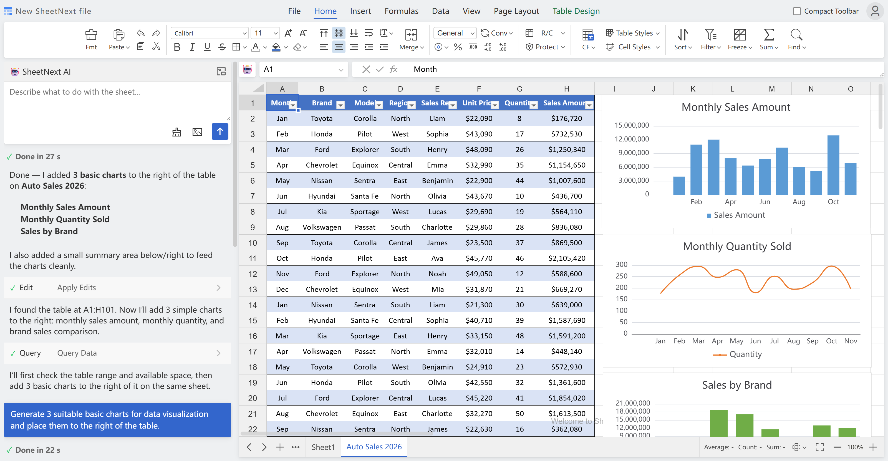

<h1 align="center">
  <span style="display: inline-flex; align-items: center; gap: 10px; white-space: nowrap; line-height: 1;">
    
    <span style="display: inline-block; transform: translateY(-2px);">SheetNext</span>
  </span>
</h1>

<p align="center">
  一款纯前端、媲美 Excel 的电子表格控件，内置原生 AI 工作流，可灵活接入大模型进行数据操作。
</p>

<p align="center">
  <a href="./README.md">English</a> | 简体中文
</p>

<p align="center">
  <a href="https://www.npmjs.com/package/sheetnext"></a>
  <a href="https://www.npmjs.com/package/sheetnext"></a>
  <a href="./LICENSE"></a>
  
  
  
</p>

<p align="center">
  
</p>

- SheetNext 是一款纯前端、高性能的电子表格引擎，为企业提供开箱即用的智能表格能力底座。
- 提供AI开发方案，一个人 + AI，即可完成企业级复杂表格业务的集成与交付。
- 台账、预算、分析、填报、审批等常见场景，几分钟产出首版。

## ✨ 核心特点

- 📊 完整的电子表格功能 — 公式引擎、图表、数据透视表、超级表、切片器、条件格式、数据验证、迷你图、冻结窗格、排序筛选等高级能力全覆盖
- 🤖 AI 智能工作流 — 内置 AI 全自动操作流程，模板生成、数据分析、公式编写、跨表逻辑轻松实现
- 📁 原生文件支持 — 原生支持 Excel (.xlsx)、CSV、JSON 导入导出，无需额外插件
- 🚀 开箱即用 — 零配置启动，所有功能内置，无需单独安装依赖库
- ⚡ 高性能渲染 — 基于 Canvas 虚拟滚动，轻松处理大数据量表格

## 🚀 快速开始

SheetNext 只需数行代码即可引入完整功能，支持 Vue、React、Angular 等任意前端框架。

### 方案一：传统开发集成

#### 使用 npm 安装

```bash
npm install sheetnext
```

```html
<!-- 放置编辑器的容器 -->
<div id="SNContainer" style="width:100vw;height:100vh;padding:0 7px 7px"></div>
```

```javascript
import SheetNext from 'sheetnext';
import 'sheetnext/dist/sheetnext.css';

const SN = new SheetNext(document.querySelector('#SNContainer'));
```

#### 浏览器直接引入（UMD）

```html
<!DOCTYPE html>
<html lang="zh-CN">
<head>
  <meta charset="UTF-8">
  <meta name="viewport" content="width=device-width, initial-scale=1.0">
  <title>SheetNext Demo</title>
  <link rel="stylesheet" href="dist/sheetnext.css">
</head>
<body>
  <div id="SNContainer" style="width:100vw;height:100vh;padding:0 7px 7px"></div>
  <script src="dist/sheetnext.umd.js"></script>
  <script>
    const SN = new SheetNext(document.querySelector('#SNContainer'));
  </script>
</body>
</html>
```

#### 国际化配置

默认语言为英文（en-US），内置中文（zh-CN）语言包。

npm 方式引入语言包：

```javascript
import SheetNext from 'sheetnext';
import zhCN from 'sheetnext/locales/zh-CN.js';

SheetNext.registerLocale('zh-CN', zhCN);

const SN = new SheetNext(document.querySelector('#SNContainer'), {
  locale: 'zh-CN'
});
```

UMD 方式引入语言包：

```html
<script src="dist/sheetnext.umd.js"></script>
<script src="dist/locales/zh-CN.js"></script>
<script>
  const SN = new SheetNext(document.querySelector('#SNContainer'), {
    locale: 'zh-CN'
  });
</script>
```

### 方案二：AI 驱动开发（推荐）

#### Step 1：下载 AI 开发资料

- 下载仓库根目录的 `docs-detail.md`：[docs-detail.md](https://github.com/wyyazlz/sheetnext/blob/master/docs/docs-detail.md)

#### Step 2：把 `docs-detail` 交给 AI

可使用 Cursor / Claude / ChatGPT / Copilot 等工具，先喂 `docs-detail` 再提需求。

推荐指令模板：

```text
你是资深 SheetNext AI 开发专家，请先阅读并理解我提供的文档，再给出可直接落地的方案。
执行顺序：
1) 先阅读：docs-detail
2) 识别用户目标（业务目标 + 技术目标）
3) 输出最小可行实现（先能跑，再优化）
4) 所有 API 与代码写法必须严格对齐文档
5) 给出验证步骤和风险点
约束：
- 不编造 API
- 不跳过边界条件
- 优先复用已有能力，避免过度设计
```

#### Step 3：给出你的业务目标

例如：

- "做一个销售数据透视分析模板，包含图表和切片器"
- "做一个多 sheet 的预算填报系统，带权限和打印"
- "把现有 Excel 模板迁移成在线可编辑版本"

## 🎯 适用场景

- 在线报表系统、BI 分析前端、经营驾驶舱
- ERP/CRM/财务/供应链系统中的表格引擎模块
- 预算、结算、对账、计划、排产等复杂业务表单
- AI 自动做表、自动分析、自动生成模板与逻辑的场景

## 浏览器支持

| Chrome | Firefox | Safari | Edge |
|--------|---------|--------|------|
| 80+ | 75+ | 13+ | 80+ |

## 许可证

Apache-2.0，详见 [LICENSE](./LICENSE)。
